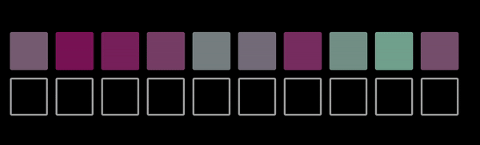
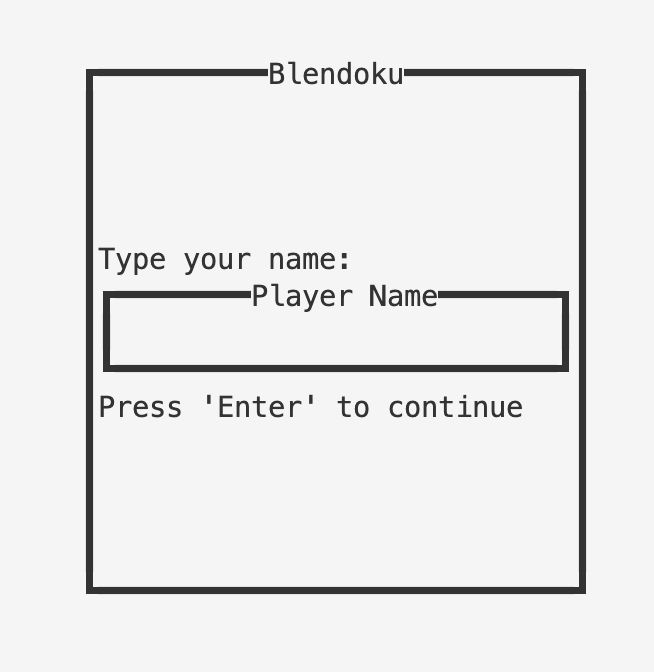
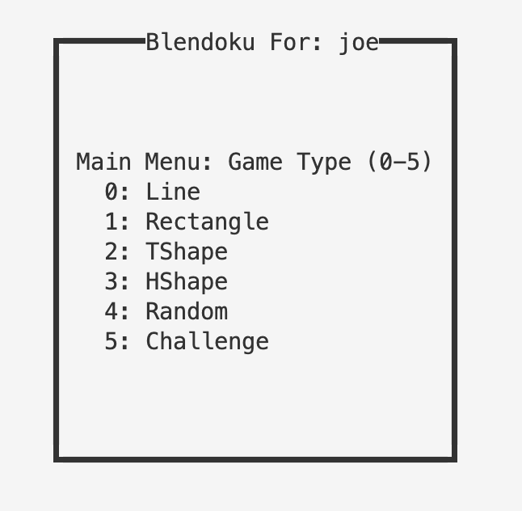
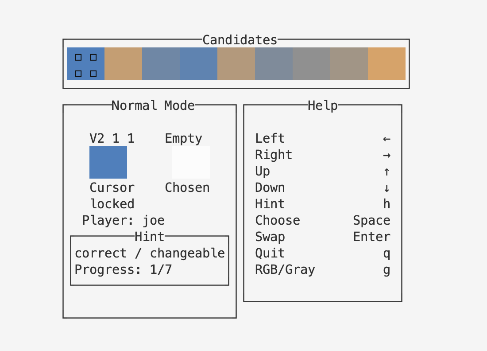

# CSE230-project

## Summary
Our team is going to build a game called **Blendoku** with Haskell. 

**Blendoku is a puzzle game that involves arranging colors in a specific order to create a gradient or blend.** The game typically presents players with a grid of colors, and the objective is to arrange them in a way that smoothly transitions from one color to another. The difficulty increases as you progress through the levels, requiring more intricate arrangements and precise color blending.

The game often includes challenges related to color perception, pattern recognition, and logical thinking. Blendoku has been available on various platforms, including mobile devices, and it has gained popularity for its unique and engaging approach to color-based puzzles. Players find it both entertaining and a good exercise for improving their understanding of color relationships.

## Game rules
In Blendoku, players are given a grid of squares, some with colors provided, some not. A palette of additional color tiles is provided. To clear a level, a player must "fill in" the empty squares from the palette in such a way as to create smooth sequences of colors both horizontally and vertically, i.e. the depth of color increases monotonously from left to right and from top to bottom. 

## Related work

We found Blendoku on the App Store as a game based on iOS released by Lonely Few LLC in 2015. A lot of people liked playing it. Even though the company doesn't update it anymore, many fans made their own versions of Blendoku. 


Searching for the keyword "Blendoku" on GitHub reveals implementations in JavaScript, PHP, TypeScript, C++, Java, Ruby, and Swift. **As of our knowledge cutoff on the date of our proposal (11/17/2023), there is no implementation in Haskell yet.** We also referred to some structures and UI implementations in a haskell-based [Tetris game](https://github.com/SamTay/tetris).

- [A demo to blendoku](http://www.blendoku.com/)
- [Blendoku2 on AppStore](https://apptopia.com/ios/app/1017177662/about)
- [Github search result for "Blendoku"](https://github.com/search?q=Blendoku&type=repositories)

Below is a `GIF` demonstrating how to play Blendoku, along with some useful links for a better understanding of the game. The GIF was created by running [the website](https://karlbao.github.io/Blendoku/), a demo project that we adopt as a non-Haskell reference for completing ours. 





## How to play (Install and run)
```shell
git clone https://github.com/Oyyko/Final-Project-Blendoku
cd Final-Project-Blendoku
stack build
stack exec Blendoku-exe
```
If `stack exec Blendoku-exe` not working, try `stack run app` instead.


## To-do list
Here are some of the tasks that we need to complete are listed as follows: 

- [X] Static UI interface: Displays color tiles (given tiles, empty tiles to fill, candidate region)
- [X] Event handle: Allows users to interact with the program by either mouse or keyboard 
- [X] Puzzle generation: Generates random graph of grids and candidate tiles
- [X] Ground truth generation: Generates ground truth for puzzle
- [X] (Optional) Hint: Allows users to seek hint
- [X] (Optional) Metrics generation: Computes the time spent on each game and output score for users.
- [?] (Optional) Ranking Competition: Rank among all game players based on the number of levels passed within the limited game time.
- [X] (Optional) Colorblind Mode: Replace the original color gradient with a grayscale gradient, where the grayscale level of each block corresponds to the brightness of its original color.

## Update

### Architecture
In this subsection, we are going to give an overview of our project Blendoku.

The entrance of our application is `main.hs`. It allows the user to input player game and pick a game type, and then execute the game.

The file, `InputPlayerName.hs` contains both the ui and the event handler for the user to input player name. An editor is rendered and the return value from the editor is passed down to later stages.


The file, `PickGameType.hs` contains both the ui and the event handler for the user to choose a game type. By choosing a number between 0 and 4, the user enters the normal mode and plays a random game of the chosen type. The number 5 indicates the challenge mode. If the is able to complete a level within 5 minutes, then the user will automatically enters next challenge. 


The main components for playing Blendoku is in the file `GameUI.hs` and `Blendoku.hs`. The former one, `GameUI.hs` can be viewed as the frontend of our applicaton. It contains three boxes. The upper is the playground where the user can navigate and swap grids to complete the game. The lower left part shows the current state of the game, including cursor grid, chosen grid, player name and hint. The lower right part is the help that gives the instruction to play Blendoku.

`Blendoku.hs` is the place for game-related classes and functions. We define `Game`, `Board`, `Cell` and several other data structures, and implement event handlers here. We also define some functions for puzzle generation.



### Challenges

We met one challenge about the appAttrMap, which defines the color for each type of displayed element. We need to include all possible color types here. As the colors generated for our game is random, the original color was in a range from 0-255 for R, G, B channels, and 256^3 was too big to be created within reasonable amount of time. In fact, it takes about 45 seconds of waiting before playing this game. 

To tackle this challenge, we make sure that the colors generated are always a multiple of 4. In this way, the number of colors reduces from 256^3 to 64^3, resulting in a rendering time within 1 seconds. We chose colors that are multiple of 16 as keyColors, and modify the implementation for color interpolation to ensure that all the randomly generated color are still multiples of 4.

### Expectations
We expect to meet our goals until deadline

